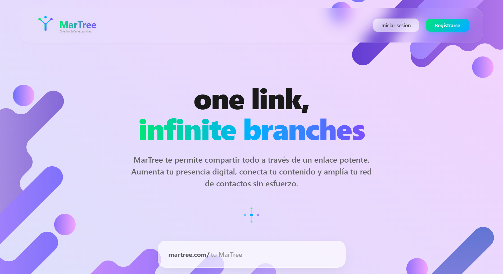
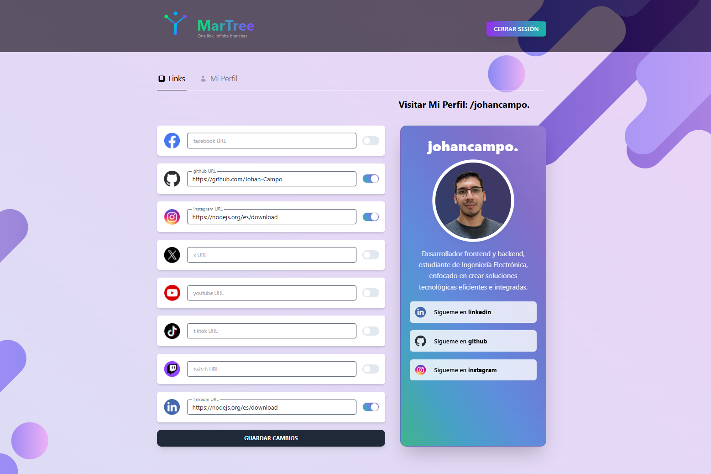

# MarTree - Frontend

MarTree es una aplicación web full-stack que permite a los usuarios crear y gestionar una página pública personalizada para centralizar sus enlaces importantes en un solo lugar.


Este repositorio contiene la aplicación frontend desarrollada con React y TypeScript.

## Vista Previa

<p align="center">
  
  
</p>

---

## Descripción del Proyecto

MarTree fue desarrollado desde cero con el objetivo de construir una aplicación moderna, segura y escalable, aplicando buenas prácticas de desarrollo full-stack.

La plataforma permite a los usuarios:

- Registrarse e iniciar sesión de forma segura
- Gestionar enlaces personalizados
- Crear una página pública dinámica
- Subir imágenes
- Administrar su perfil

El enfoque principal del proyecto fue implementar una arquitectura limpia, seguridad robusta y una experiencia de usuario fluida.

---

## Stack Tecnológico

### Frontend

- React
- TypeScript
- React Router DOM
- TanStack Query (React Query)
- Axios
- Tailwind CSS

### Backend (Repositorio separado)

- Express
- MongoDB
- JWT (JSON Web Tokens)
- Express Validator
- Cloudinary
- Configuración de CORS
- Hashing seguro de contraseñas

### Repositorio del Backend:  
(https://github.com/Johan-Campo/deploy_MarTree_backend)

---

## Características de Seguridad

- Autenticación basada en JWT
- Contraseñas hasheadas de forma segura
- Validación de datos con Express Validator
- Manejo adecuado de CORS
- Rutas protegidas
- Comunicación segura entre cliente y servidor

---

## Funcionalidades Principales

- Registro e inicio de sesión
- Gestión de sesión mediante token
- CRUD completo de enlaces
- Página pública dinámica por usuario
- Subida de imágenes con Cloudinary
- Manejo eficiente del estado del servidor con TanStack Query
- Manejo de errores y validaciones en formularios

---

## Arquitectura

El frontend se comunica con una API REST construida con Express.

El estado del servidor se gestiona utilizando TanStack Query para optimizar:
- Cache
- Refetch automático
- Sincronización de datos

El enrutamiento se implementa con React Router DOM, incluyendo protección de rutas privadas.

La estructura del proyecto está organizada de forma modular para facilitar mantenimiento, escalabilidad y claridad del código.

---

## Instalación

1. Clona el repositorio:

  ```bash
  git clone https://github.com/Johan-Campo/deploy-MarTree-frontend.git
  ```
2. Instala las dependencias:

   ```bash
   npm install
   ```
3. Ejecuta el entorno de desarrollo:

    ```bash
   npm run dev
   ```
## Deploy

El frontend se encuentra desplegado en Netlify.

El backend está desplegado de manera independiente en Render.

## Nota

Este proyecto fue desarrollado con fines de aprendizaje avanzado y portafolio profesional, aplicando estándares modernos de desarrollo full-stack.

   


